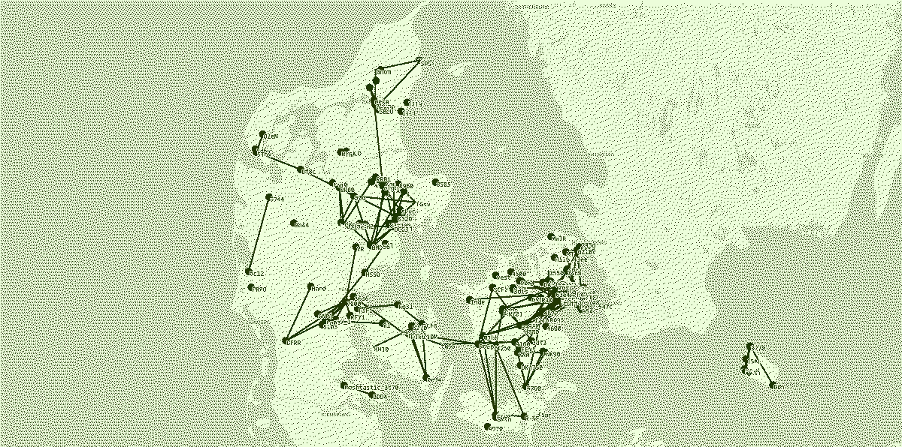

# Danske Meshtastic Brugere

Velkommen til _Danske Meshtastic Brugere_, et landsdækkende Dansk gruppe for _LoRaWAN®_ med fokus på kommunikation via [Meshtastic](https://meshtastic.org/).

**Lige nu en meget sparsom side, men vi vil forsøge at samle forskellige ressourcer for danske brugere ét sted. Hvis du har forslag til hjemmesiden så kig i sektionen for [bidrag](#bidrag)**

## Om gruppen
Gruppen er frivillig organiseret vores primære mødepunkt er på [Discord server](/discord) samt denne hjemmside. 

Målet med selve gruppen er:
- At skabe et samlet sted hvor Danskere kan finde information omkring Meshtastic i relation til Danmark
- Skabe rammere for koordinering af Meshtastic netværket i Danmark og på sigt mellem nabolande.

Alle er velkommen til at forslå ændringer til hjemmesiden via [GitHub](https://github.com/Danske-Meshtastic-Brugere/meshbrugere.dk), men hvis man ikke er til dét så hop på vores [Discord server](/discord) hvis du har forslag eller vil hjæpe til :)

## Kom igang 
For at komme igang med at kommunikere over Meshtastic netværket, så er der 3 overordnet skridt:

1. Anskaf en Meshtastic enhed
2. Installer Meshtastic på din enhed
3. Konfigurering af din enhed til dit lokale miljø

### 1. Enhed

### 2. Installation
Flere udbyder tilbyder nu til dags fabriks installation af Meshtastic på forhånd. Dette er nemt hvis du blot vil i gang med det samme.

Vi anbefaler du følger den officelle guide til opsætning af din meshtastic

### 3. Konfigurering

[Thomas Scherrer](https://www.youtube.com/@TeardownOZ2CPU) har lavet en dybdegående instruksvideo for hvordan du kan komme igang med at sætte din Meshtastic enhed om som kan ses her:

<iframe width="560" height="315" src="https://www.youtube.com/embed/fL9oKftoQ8g?si=aZ2QI41zj3fb9ET5" title="YouTube video player" frameborder="0" allow="accelerometer; autoplay; clipboard-write; encrypted-media; gyroscope; picture-in-picture; web-share" referrerpolicy="strict-origin-when-cross-origin" allowfullscreen></iframe>
*Tak til Thomas for tilladelse for at dele videon her*

## Find mere
Hvis du gerne vil vide mere om Meshtastic og ikke kan finde det her eller på vores Discord så er der utallige sider derude - og ligesom mesh netværket, så styrker det vores samarbejder hvis vi kan linke til hinanden på internettet :-)

- [Meshtastic Denmark på Facebook](https://www.facebook.com/groups/1553839535376876/)
- [Zyberdata.dk Meshtastic Denmark side](https://zyberdata.dk/meshtastic-denmark/)

*Not affiliated with meshtastic.org - Ikke tilknyttet meshtastic.org*